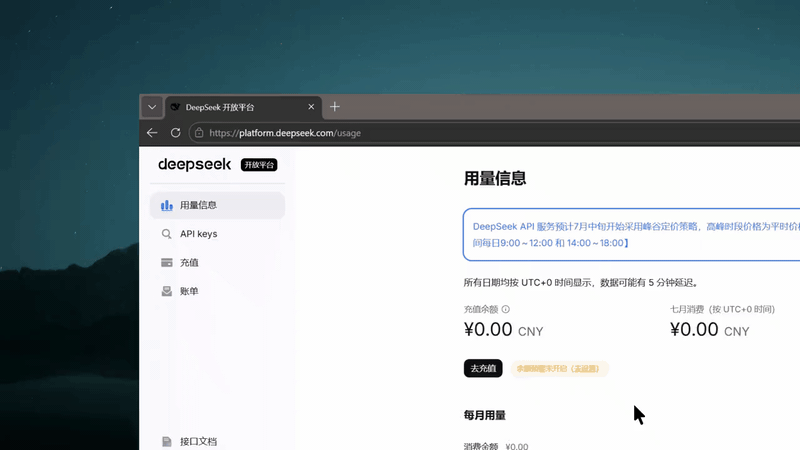
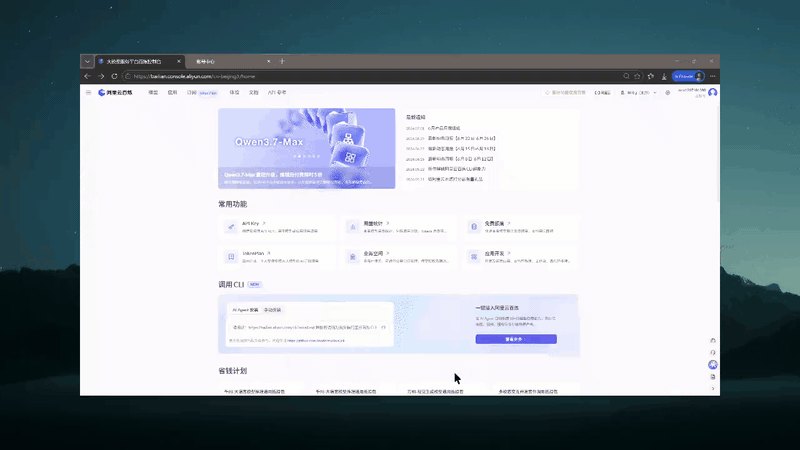
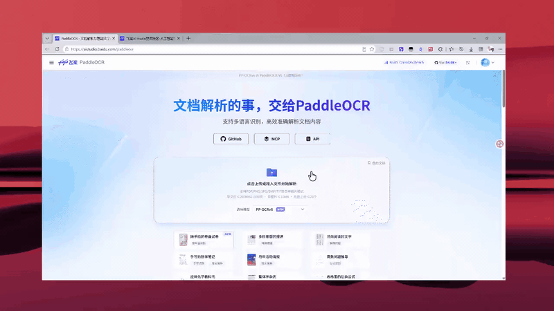

# Smart Scribe

Smart Scribe 是一个把短视频变成个人知识库素材的小工具。

我做它的原因很简单：平时刷抖音、B 站或者看一些项目介绍视频时，经常会看到很有用的内容。比如一个工具推荐、一个 GitHub 项目、一段课程讲解、一页 PPT、一个评论区补充。但看完之后，这些东西通常就散在脑子里了，很难真正放进自己的知识库。

现在市面上很多工具更偏会议场景，比如飞书妙记、会议转写、录音总结之类。它们更适合“开会之后生成会议纪要”。但我想解决的是另一个问题：

> 我刷到一个短视频，觉得它有价值，能不能把它变成一张能放进 Obsidian 的知识卡片？

Smart Scribe 就是为这个场景做的。

## 它能做什么

最简单的用法是：

1. 上传一个本地视频、音频、图片，或者粘贴一个视频链接。
2. 等它自动处理：抽帧、OCR、语音转写、生成总结。
3. 如果觉得漏了重点，可以自己选帧，或者继续追加素材。
4. 最后导出成 Obsidian Markdown，复制到自己的笔记库里。

它不是只给你一段“AI 总结”。它会尽量把视频里的画面、语音、原文、引用关系都保留下来，让你后面还能回头检查。

## 最终想做成什么样

我最核心的想法，其实是减少输入压力。

现在这个版本还是一个 Web 工作台：你打开页面，上传素材，等它处理，再复制 Markdown 到 Obsidian。这个流程已经能用，但它还不是我心里最顺手的形态。

我更想要的最终状态是：

```text
抖音刷到好视频
-> 直接复制链接，丢给微信/机器人/任何顺手的入口
-> AI 自己调用转写和整理工具
-> 结构化写入 Obsidian 知识库
-> 返回一份摘要给我看，或者静默积累
```

也就是说，用户最好不需要专门打开一个复杂工具，也不需要认真填写一堆表单。只要在最方便的地方把内容丢进去，后面的下载、转写、抽帧、OCR、总结、入库都尽量自动完成。

如果以后抖音或者其他平台能有官方入口当然更好，但即使没有，也可以先从微信、机器人、快捷指令、浏览器扩展这类入口开始。Smart Scribe 现在的 Web 工作台，更像是这条链路里的“处理核心”：先把内容真正整理干净，再慢慢把入口做轻。

## 我觉得比较重要的几个点

### 1. 可以上传本地素材，也可以粘贴链接

你可以上传本地视频、音频、图片，也可以直接粘贴抖音、Bilibili、YouTube 或直链。

对我来说，这个入口很重要。因为真实使用时，我不是先把视频下载好再整理，而是刷到一个东西，觉得有用，就想赶紧丢进去处理。

### 2. 它会同时看“画面”和“声音”

很多短视频的问题是：有价值的信息不一定在语音里。

比如画面里出现了项目名、链接、PPT 关键词、代码片段、评论区截图。如果只做语音转写，很容易把这些漏掉。

Smart Scribe 会把视频抽成关键画面做 OCR，也会把音频转成文字。最后总结时，画面证据和语音证据会一起参与。

### 3. 有证据链，不是凭空总结

处理完之后，内容会被拆成一块块证据：

- `S001`、`S002`：语音转写证据。
- `P001`、`P002`：画面 OCR 证据。

AI 生成总结时，会尽量带着这些引用。这样你看到一个结论时，可以回头找到它来自哪一段语音、哪一张画面。

这是我一开始就很想保留的东西：原文和总结不要互相替代，而是应该共存。

### 4. 可以自己选帧，再处理一次

自动抽帧不可能永远正确。

有些视频里，某一页 PPT、某个评论截图、某个关键画面可能刚好没被抽到。这个时候可以在播放器里自己选帧，把它补进去。

这个功能对我来说很亮眼。因为它不是让用户完全相信算法，而是允许用户把自己觉得重要的画面重新塞回证据链里。

### 5. 可以继续追加素材

有时候一个视频不够完整，你可能还想补一张截图、补一段音频、补另一个相似视频。

Smart Scribe 支持在同一个会话里继续追加素材。追加之后会自动重新生成总结，不用你再手动点“重新生成”。

我的理解是：追加素材通常代表“用户觉得它很重要”。所以这些内容会被当成重点补充，尽量避免在重新总结时被原来的大段内容淹没。

### 6. 最后可以导出成 Obsidian 笔记

这一步是我觉得真正“内化”的关键。

我自己的使用方式是：

1. 上传视频或链接。
2. 等它处理完。
3. 生成总结和详细原文。
4. 导出 Markdown。
5. 复制到 Obsidian 里，再按照自己的笔记规则继续整理。

导出的 Markdown 会包含摘要、核心要点、证据引用、来源链接、证据索引和详细原文。它不是最终答案，但它是一个很好的知识库底稿。

## 快速开始

### 方法一：Windows 浏览器版

```powershell
git clone https://github.com/newspidernet-star/smart-scribe.git
cd smart-scribe
./start-windows.bat
```

启动后打开：

```text
http://localhost:8000
```

第一次运行会自动检查 Python、Node.js、ffmpeg、cloudflared，安装依赖并构建前端。

这个入口适合开发、排查问题，或者你就是习惯用浏览器窗口。

### 方法二：Windows 桌面版

如果你希望它像一个普通桌面软件一样打开，有自己的窗口、最小化 / 最大化 / 关闭按钮、启动页和系统托盘，可以用这个入口：

```powershell
git clone https://github.com/newspidernet-star/smart-scribe.git
cd smart-scribe
./start-desktop.bat
```

`start-desktop.bat` 会优先启动已经构建好的：

```text
desktop/dist/Smart-Scribe/Smart Scribe.exe
```

如果这个 exe 还不存在，它会进入 Electron 开发模式，并在第一次运行时安装桌面壳需要的依赖。

桌面版仍然复用同一套本地服务：

- 首次运行时，如果后端依赖没装好，会自动运行 `scripts/setup-windows.ps1`。
- 依赖就绪后，Electron 会以 `SMART_SCRIBE_NO_BROWSER=1` 模式启动后端，不会再额外打开浏览器。
- 后端就绪前会先显示启动页，第一次安装时会显示安装进度，平时启动只显示加载状态。
- 关闭窗口时，可以选择隐藏到系统托盘，也可以直接退出并关闭本地后端。

> 现在的桌面版不是完全免安装包。它更像是“把本地 Web 应用包装成一个舒服的桌面窗口”：用户仍然需要能安装 Python、Node.js、ffmpeg 等运行依赖，首次启动脚本会尽量自动处理。

### 方法三：Docker

```bash
git clone https://github.com/newspidernet-star/smart-scribe.git
cd smart-scribe
docker compose up --build
```

启动后同样打开：

```text
http://localhost:8000
```

Docker 镜像会先构建前端，再由后端统一托管页面和接口。

## 更完整的功能说明

### 素材处理

- 支持视频、音频、图片。
- 支持本地上传和链接下载。
- 支持同一个会话继续追加素材。
- 支持视频画面抽帧、OCR、语音转写。
- 支持手动选帧补充。

### 抽帧和 OCR

Smart Scribe 会根据视频内容选择关键画面。

PPT/课程类视频会尽量保留信息更完整的画面；抖音、评论、混剪类视频会更重视覆盖率；长视频会按时长和场景数量动态提高抽帧预算，但仍然控制上限，避免 OCR 成本失控。

处理日志里也会记录候选帧为什么被保留或丢弃，方便后续调试。

### 总结和引用

AI 总结会基于证据块生成，而不是只看一段转写文本。它会尽量把画面 OCR 和语音 ASR 一起纳入判断。

如果画面文字和语音转写冲突，通常会优先相信画面 OCR。因为很多专有名词、项目名、代码片段，画面上的文字往往比语音转写更可靠。

### Markdown 导出

导出的 Markdown 面向 Obsidian，包含：

- YAML frontmatter
- AI 摘要
- 核心要点和证据引用
- 来源链接
- 证据索引
- 可折叠的详细原文

目标是让它成为一份干净的知识卡片底稿，而不是还需要大量清洗的 AI 输出。

## 技术栈

| 部分 | 技术 |
| --- | --- |
| 后端 | FastAPI, SQLAlchemy, SQLite, ffmpeg |
| 前端 | React, Vite, TypeScript, Tailwind CSS, TanStack Query |
| OCR | PaddleOCR Cloud 或本地 PaddleOCR |
| ASR | DashScope / Fun-ASR |
| AI 总结 | DeepSeek |
| 导出 | Obsidian-compatible Markdown |

## API Key

打开应用右上角设置，填写：

- `deepseek_api_key`：用于 AI 总结。
- `dashscope_api_key`：用于语音转写。
- `paddleocr_cloud_key`：用于云端 OCR。
- `dashscope_workspace_id`：可选。
- `ytdlp_cookie_path`：可选，用于需要登录的视频源。

也可以通过环境变量配置：

```dotenv
SMART_SCRIBE_DEEPSEEK_API_KEY=sk-xxx
SMART_SCRIBE_DASHSCOPE_API_KEY=sk-xxx
SMART_SCRIBE_PADDLEOCR_CLOUD_KEY=xxx
SMART_SCRIBE_DASHSCOPE_WORKSPACE_ID=ws-xxx
```

如果不知道这些 Key 去哪里找，可以看下面几段演示：

### DeepSeek API Key



### DashScope API Key



### PaddleOCR Cloud Key



## 项目边界

这个项目一开始也想过往会议录制、屏幕录制、实时上传这些方向扩展。但这些功能会让项目变得很重，也容易让定位变散。

现在 Smart Scribe 更适合专注在：

```text
已有素材 -> 证据化整理 -> AI 总结 -> Obsidian 知识卡片
```

如果要做会议录制或屏幕捕获，更合理的方式可能是让独立工具负责采集，比如我之前的 PPT-Grabber，再把素材交给 Smart Scribe 整理：

```text
PPT-Grabber / 录制工具 -> frames + audio + manifest -> Smart Scribe -> Obsidian
```

这样边界更清楚，也更容易维护。

## 接下来想做

- 继续打磨移动端和平板端体验。
- 让 Docker 体验尽量接近 Windows 一键启动。
- 继续清理 Markdown 导出模板，让它更像干净的知识卡片。
- 后面再评估 exe/桌面化封装。

## 目录结构

```text
smart-scribe/
  backend/                 FastAPI 后端
  frontend/                React 工作台
  scripts/                 Windows 安装和启动脚本
  docs/                    API Key 获取演示和设计记录
  docker-compose.yml
  start-windows.bat
```

## 许可

当前为个人项目，暂未开放正式许可证。
